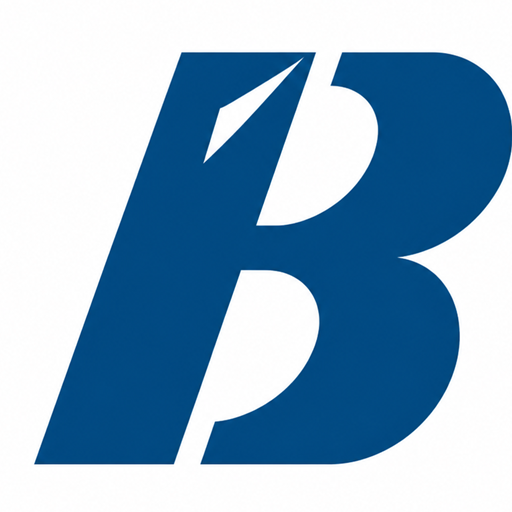
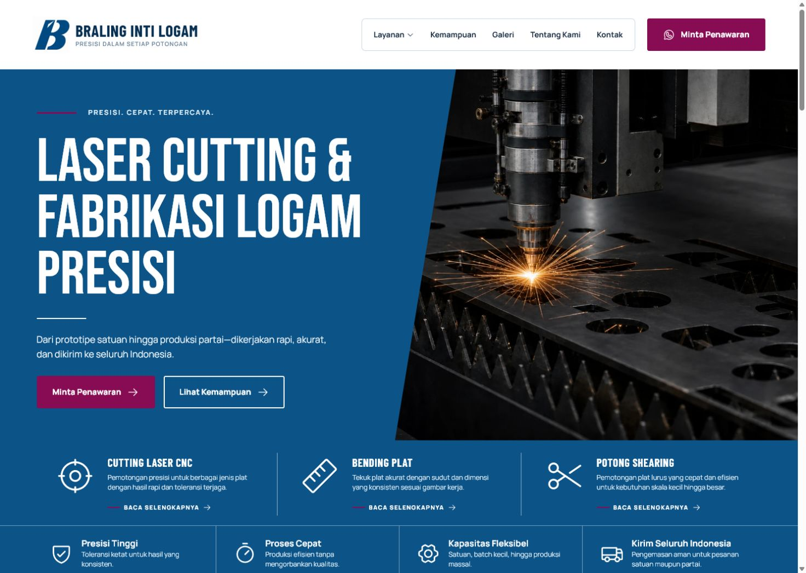

<div align="center">
  
  <h1>Braling Inti Logam — Landing Page</h1>
  <p>A modern, accessible landing page for a precision laser-cutting and metal-fabrication company.</p>

  <p>
    
    
    
    
  </p>
</div>



## Overview

This project redesigns Braling Inti Logam's web presence around a clear industrial visual system, focused service information, and a direct WhatsApp quotation journey. The experience is responsive, keyboard-friendly, and intentionally lightweight.

## Highlights

- Strong split-layout hero with an immediate quotation CTA
- Laser cutting, bending, welding, and fabrication service overview
- Trust signals and a clear production process
- Accessible, validated quotation form that prepares a WhatsApp message
- Smooth entrance and interaction animations with reduced-motion support
- Responsive navigation and layouts for desktop, tablet, and mobile
- Semantic HTML, visible focus states, image alt text, and skip navigation
- Optimized local WebP photography and self-hosted typography

## Design system

The interface follows the requested 60–30–10 color balance:

| Role | Color | Usage |
| --- | --- | --- |
| Primary | `#0c5488` | Industrial blue surfaces and structure |
| Secondary | `#ffffff` | Content, contrast, and breathing room |
| Accent | `#880c54` | Calls to action and key emphasis |

Typography combines **Bebas Neue** for high-impact display headings with **Manrope** and **Barlow Condensed** for readable supporting content.

## Getting started

```bash
npm install
npm run dev
```

Open the local URL printed by Vite, usually `http://localhost:5173`.

## Available commands

```bash
npm run dev         # Start the development server
npm run build       # Create the production build
npm run preview     # Preview the production build locally
npm run test:sites  # Run hosting worker tests
```

## Project structure

```text
braling-landing-page/
├── public/assets/      # Logo and optimized WebP photography
├── src/                # React application and design system styles
├── tests/              # Hosting behavior tests
├── worker/             # Static hosting worker
├── screenshots/        # Design reference and QA evidence
└── design-qa.md        # Visual and accessibility QA notes
```

## Verification

- Production build: passing
- Hosting tests: 4/4 passing
- Desktop and mobile overflow checks: passing
- Keyboard navigation and mobile menu behavior: verified
- `prefers-reduced-motion`: supported

## Notes

The quotation form does not store visitor information. It formats the submitted details into a WhatsApp message so the visitor can review and send it directly.

---

<div align="center">
  Built for Braling Inti Logam — presisi dalam setiap potongan.
</div>
